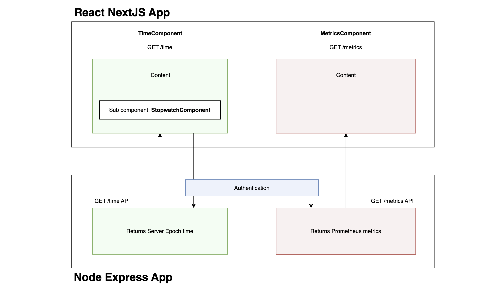
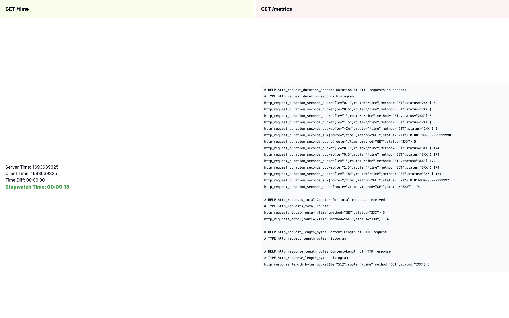
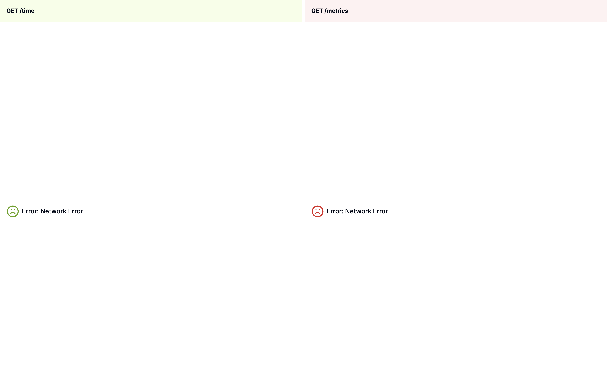
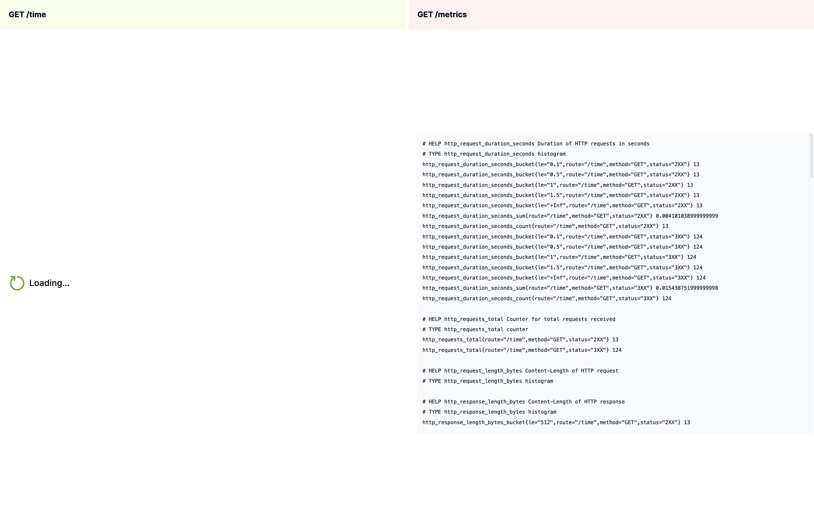
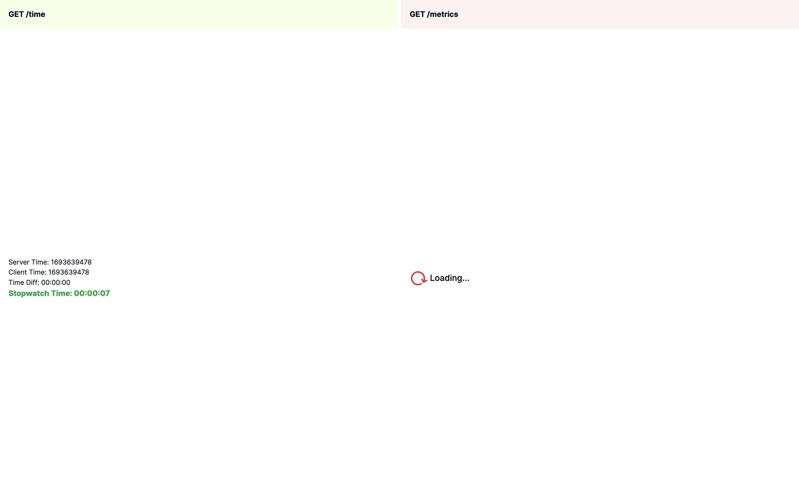

## NodeJS - Express App

Directory: `nodejs-express-app`

## React - NextJS App

Directory: `react-nextjs-app`

## Instructions

Instructions for each app are in their respective directories.

## Architecture

## Screenshots

On Successfull API calls:

On Error:

Waiting for GET /time:

Waiting for GET /metrics:

